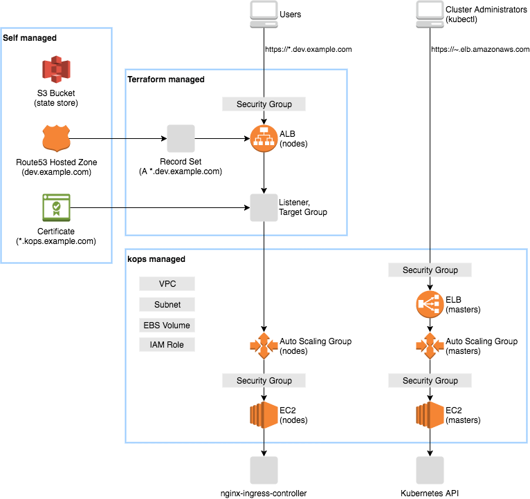

# Kubernetes starter with kops and Terraform

This is a Kubernetes starter with kops and Terraform to build the following stack.



## Goals

- You can operate the cluster by `kops`
- You can access to the Kunernetes API by `kubectl`
- You can access to services via a HTTPS wildcard domain

## Getting Started

### Prerequisite

You must have followings:

- an AWS account
- an IAM user with [these permissions](https://github.com/kubernetes/kops/blob/master/docs/aws.md)
- a Route53 hosted zone for the wildcard domain, e.g. `dev.example.com`
- an ACM certificate for the wildcard domain, e.g. `*.dev.example.com`

Install following tools:

```sh
brew install kops
brew install kubernetes-helm
brew install awscli
brew install terraform
```

### Create a state store

Set the cluster information.

```sh
# .env
export TF_VAR_kops_cluster_name=hello.k8s.local
export TF_VAR_alb_external_domain_name=dev.example.com
export AWS_DEFAULT_REGION=us-west-2
export KOPS_STATE_STORE=s3://state.$TF_VAR_kops_cluster_name
```

Create a bucket for the kops state store and the Terraform state store.

```sh
aws s3api create-bucket \
  --bucket state.$TF_VAR_kops_cluster_name \
  --region $AWS_DEFAULT_REGION \
  --create-bucket-configuration LocationConstraint=$AWS_DEFAULT_REGION
aws s3api put-bucket-versioning \
  --bucket state.$TF_VAR_kops_cluster_name \
  --versioning-configuration Status=Enabled
```

### Create a cluster

Generate a key pair to connect to Kubernetes nodes.

```sh
ssh-keygen -f .sshkey
```

Create a cluster.

```sh
kops create cluster \
  --name ${TF_VAR_kops_cluster_name} \
  --zones ${AWS_DEFAULT_REGION}a,${AWS_DEFAULT_REGION}b,${AWS_DEFAULT_REGION}c \
  --authorization RBAC \
  --ssh-public-key=.sshkey.pub
kops update cluster $TF_VAR_kops_cluster_name
kops update cluster $TF_VAR_kops_cluster_name --yes
kops validate cluster
kubectl get nodes
```

### Create a load balancer

Initialize Terraform.

```sh
cd ./aws
terraform init \
  -backend-config="bucket=state.$TF_VAR_kops_cluster_name" \
  -backend-config="key=terraform.tfstate"
```

Create a load balancer and update the Route53 zone.

```sh
terraform plan
terraform apply
```

### Install system services

Initialize the helm.

```sh
kubectl create -f helm/rbac-config.yaml
helm init --service-account tiller
helm repo update
```

Install the ingress controller.

```sh
helm install stable/nginx-ingress --namespace kube-system --name nginx-ingress -f helm/nginx-ingress-config.yaml
```

Open https://dummy.dev.example.com and it should show `default backend - 404`.

Install the dashboard.

```sh
helm install stable/kubernetes-dashboard --namespace kube-system --name kubernetes-dashboard -f helm/kubernetes-dashboard-config.yaml
kubectl proxy
```

Open http://localhost:8001/api/v1/namespaces/kube-system/services/kubernetes-dashboard-kubernetes-dashboard/proxy/.

### Deploy echoserver

Create a deployment, service and ingress.

```sh
kubectl apply -f echoserver.yaml
```

Open https://echoserver.dev.example.com.

### Cleanup

```sh
terraform destroy
kops delete cluster --name $TF_VAR_kops_cluster_name --yes
```

## Tips

### Working with managed services

You can attach the security group `allow-from-nodes.hello.k8s.local` to managed services such as RDS.

### Team development

It is recommended that the cluster name, S3 bucket name and AWS region are described in [`aws/vars.tf`](aws/vars.tf) for team development.
You can guide a team member as follows:

Install following tools:

```sh
brew install kops
brew install kubernetes-helm
brew install terraform
```

Initialize the kubectl context.

```sh
kops export kubecfg --state=s3://state.hello.k8s.local --name hello.k8s.local
kubectl get nodes
```

Initialize the Terraform.

```sh
cd aws
terraform init
```

### Restrict access

You can restrict API and SSH access by editing the cluster spec.

```sh
kops edit cluster
```

```yaml
spec:
  kubernetesApiAccess:
  - xxx.xxx.xxx.xxx/32
  sshAccess:
  - xxx.xxx.xxx.xxx/32
```

You can restrict access to services (the external ALB) by Terraform.
Also you should enable the internal ALB to make nodes can access to services via the same domain.

```yaml
variable "alb_external_allow_ip" {
  default = [
    "xxx.xxx.xxx.xxx/32",
  ]
}

variable "alb_internal_enabled" {
  default = false
}
```

### Reduce cost for experimental use

Use the minimum instance type and reduce root volume.

```sh
kops edit ig master-us-west-2a
```

```yaml
spec:
  machineType: t2.micro
  rootVolumeSize: 20
```

Use spot instances, reduce root volume and specify the single AZ.

```sh
kops edit ig nodes
```

```yaml
spec:
  machineType: m3.medium
  maxPrice: "0.02"
  rootVolumeSize: 20
  subnets:
  - us-west-2a
```

Use DNS instead of ELB.
You have to manually maintain the A record for master.

```sh
kops edit cluster
```

```yaml
spec:
  api:
    dns: {}
  masterPublicName: api.hello.k8s.local.dev.example.com
```
