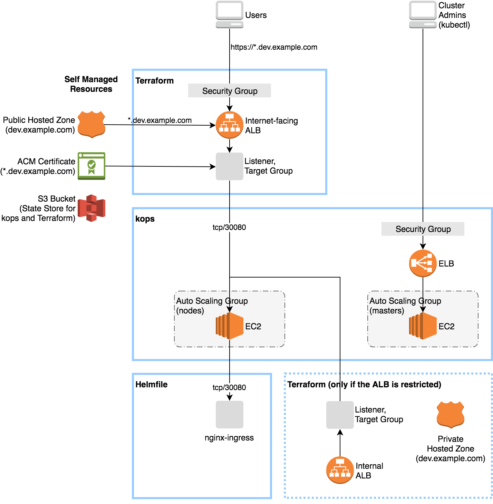

# Kubernetes on AWS with kops and Terraform

This bootstraps the following stack in a few minutes:



## Goals

- Expose services via HTTPS using [nginx-ingress](https://github.com/kubernetes/charts/tree/master/stable/nginx-ingress), NodePort, ALB, ACM and Route53.
- Bootstrap a cluster by the script.
- Manage the cluster using `kubectl`, `helmfile`, `kops` and `terraform`.


## Build a new cluster

Make sure you have the following items:

- An AWS account
- An IAM user with [these permissions](https://github.com/kubernetes/kops/blob/master/docs/aws.md)
- A domain or subdomain, e.g. `dev.example.com`

Install the following tools:

```sh
# macOS
brew install awscli kubectl kops terraform helm helmfile

# WSL/Ubuntu
sudo apt install awscli
./00-install.sh   # Install kubectl, kops, helm, terraform and helmfile
```


### 1. Configure

Change [`01-env.sh`](01-env.sh) with your environment values.
If you do not want to push the environment values to the Git repository, you can put your values into `.env` instead.

Then load the values.

```sh
source 01-env.sh
```

Configure your AWS credentials.

```sh
aws configure --profile "$AWS_PROFILE"
```


### 2. Setup

#### 2-1. Route53

Create a public hosted zone for the domain:

```sh
aws route53 create-hosted-zone --name "$kubernetes_ingress_domain" --caller-reference "$(date)"
```

You may need to add the NS records to the parent zone.


#### 2-2. ACM

Request a certificate for the wildcard domain:

```sh
aws acm request-certificate --domain-name "*.$kubernetes_ingress_domain" --validation-method DNS
```

You need to approve the DNS validation.
Open https://console.aws.amazon.com/acm/home and click the "Create record in Route53" button.
See [AWS User Guide](https://docs.aws.amazon.com/acm/latest/userguide/gs-acm-validate-dns.html) for more.


#### 2-3. S3

Create a bucket for state store of kops and Terraform.
You must enable bucket versioning.

```sh
aws s3api create-bucket \
  --bucket "$state_store_bucket_name" \
  --region "$AWS_DEFAULT_REGION" \
  --create-bucket-configuration "LocationConstraint=$AWS_DEFAULT_REGION"
aws s3api put-bucket-versioning \
  --bucket "$state_store_bucket_name" \
  --versioning-configuration "Status=Enabled"
```


### 3. Bootstrap

By default the script will create the following components:

- kops
  - 1 master (t2.medium) in a single AZ
  - 2 nodes (t2.medium) in a single AZ
- Terraform
  - An internet-facing ALB
  - A Route53 record for the internet-facing ALB
  - A security group for the internet-facing ALB
  - An EFS filesystem for Persistent Volumes
  - An Elasticsearch domain for Kubernetes logs
- kubectl
  - Create `ServiceAccount` and `ClusterRoleBinding` for the Helm tiller
  - Patch `StorageClass/gp2` to remove the default storage class
- Helm
  - [`stable/nginx-ingress`](https://github.com/kubernetes/charts/tree/master/stable/nginx-ingress)
  - [`stable/kubernetes-dashboard`](https://github.com/kubernetes/charts/tree/master/stable/kubernetes-dashboard)
  - [`int128.github.io/kubernetes-dashboard-proxy`](https://github.com/int128/kubernetes-dashboard-proxy)
  - [`stable/heapster`](https://github.com/kubernetes/charts/tree/master/stable/heapster)
  - [`stable/efs-provisioner`](https://github.com/helm/charts/tree/master/stable/efs-provisioner)
  - [`stable/fluent-bit`](https://github.com/helm/charts/tree/master/stable/fluent-bit)
  - [`stable/kibana`](https://github.com/helm/charts/tree/master/stable/kibana)

Bootstrap a cluster.

```sh
./02-bootstrap.sh
```


### 4. Customize

#### 4-1. Change instance type

You can change instance type of the master:

```sh
kops edit ig "master-${AWS_DEFAULT_REGION}a"
```

You can change instance type of the nodes:

```sh
kops edit ig "nodes-${AWS_DEFAULT_REGION}a"
```

Apply the changes:

```sh
kops update cluster
kops update cluster --yes
```


#### 4-2. Restrict access to Kubernetes API and SSH

To change access control for the Kubernetes API and SSH:

```sh
kops edit cluster
```

```yaml
spec:
  kubernetesApiAccess:
  - xxx.xxx.xxx.xxx/32
  sshAccess:
  - xxx.xxx.xxx.xxx/32
```

Apply the changes for the Kubernetes API and SSH:

```sh
kops update cluster
kops update cluster --yes
```


#### 4-3. Restrict access to internet-facing ALB

The following resources are needed so that the masters and nodes can access to services in the VPC:

- An internal ALB
- A Route53 private hosted zone for the internal ALB
- A Route53 record for the internal ALB
- A security group for the internal ALB

To change access control for the internet-facing ALB, edit `tf_config.tf`:

```tf
variable "alb_external_allow_ip" {
  default = [
    "xxx.xxx.xxx.xxx/32",
    "xxx.xxx.xxx.xxx/32",
  ]
}

variable "alb_internal_enabled" {
  default = true
}
```

Apply the changes for the internet-facing ALB:

```sh
terraform apply
```


#### 4-4. OIDC authentication

You can setup OIDC authentication for exposing Kubernetes Dashboard and Kibana.

If you want to use your Google Account, create an OAuth client on [Google APIs Console](https://console.developers.google.com/apis/credentials) and change the client ID and secret in `01-env.sh` as follows:

```sh
export oidc_discovery_url=https://accounts.google.com
export oidc_kubernetes_dashboard_client_id=xxx-xxx.apps.googleusercontent.com
export oidc_kubernetes_dashboard_client_secret=xxxxxx
export oidc_kibana_client_id=xxx-xxx.apps.googleusercontent.com
export oidc_kibana_client_secret=xxxxxx
```

See also the tutorial at [int128/kubernetes-dashboard-proxy](https://github.com/int128/kubernetes-dashboard-proxy).


#### 4-5. Working with managed services

Terraform creates the security group `allow-from-nodes.hello.k8s.local` which allows access from the Kubernetes nodes.
You can attach the security group to managed services such as RDS or Elasticsearch.

See also [tf_managed_services.tf](tf_managed_services.tf).


## Manage the cluster

Tell the following steps to your team members.

### On boarding

```sh
source 01-env.sh

# Configure your AWS credentials.
aws configure --profile "$AWS_PROFILE"

# Initialize kubectl and Terraform.
./10-init.sh
```

### Daily operation

```sh
source 01-env.sh

# Now you can execute the following tools.
kops
terraform
helmfile
```


## Destroy the cluster

**WARNING:** `kops delete cluster` command will delete all EBS volumes with a tag.
You should take snapshots before destroying.

```sh
terraform destroy
kops delete cluster --name "$KOPS_CLUSTER_NAME" --yes
```


## Cost

Running cost depends on number of masters and nodes.

### Minimize cost for testing

Here is a minimum configuration with AWS Free Tier (first 1 year):

Role | Kind | Spec | Monthly Cost
-----|------|------|-------------
Master  | EC2 | m3.medium spot | $5
Master  | EBS | gp2 10GB | free
Master  | EBS for etcd | gp2 5GB x2 | free
Node    | EC2 | m3.medium spot | $5
Node    | EBS | gp2 10GB | free
Cluster | EBS for PVs | gp2 | $0.1/GB
Cluster | ALB | - | free
Cluster | Route53 Hosted Zone | - | $0.5
Cluster | S3  | - | free
Managed | EFS | General Purpose up to 5GB | free
Managed | RDS | t2.micro gp2 20GB | free
Managed | Elasticsearch | t2.small gp2 10GB | free

The cluster name must be a domain name in order to reduce an ELB for masters.

```sh
# 01-env.sh
kubernetes_cluster_name=dev.example.com
```

Reduce size of the volumes:

```yaml
# kops edit cluster
spec:
  etcdClusters:
  - etcdMembers:
    - instanceGroup: master-us-west-2a
      name: a
      volumeSize: 5
    name: main
    version: 3.2.14
  - etcdMembers:
    - instanceGroup: master-us-west-2a
      name: a
      volumeSize: 5
    name: events
    version: 3.2.14
---
# kops edit ig master-us-west-2a
spec:
  machineType: m3.medium
  maxPrice: "0.02"
  rootVolumeSize: 10
---
# kops edit ig nodes
spec:
  machineType: m3.medium
  maxPrice: "0.02"
  rootVolumeSize: 10
  subnets:
  - us-west-2a
```


## Contribution

This is an open source software licensed under Apache License 2.0.
Feel free to bring up issues or pull requests.
